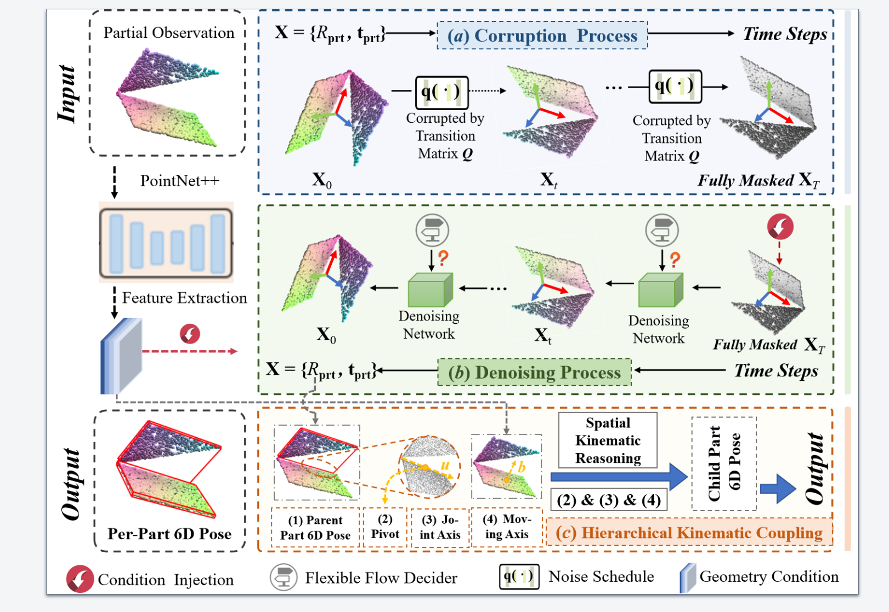

# Advancing Category-level Articulated Object Pose Estimation in Discrete State-Spaces

## Overview

## Requirements
- Ubuntu 20.04
- Python 3.8.15
- Pytorch 1.12.0
- Pytorch3d 0.7.2
- CUDA 11.3
- 1 * NVIDIA RTX 3090

## Installation

- ### Install pytorch
``` bash
pip install torch==1.12.0+cu113 torchvision==0.13.0+cu113 torchaudio==0.12.0 --extra-index-url https://download.pytorch.org/whl/cu113
```
- ### Install from requirements.txt
``` bash
pip install -r requirements.txt 
```

- ### Install pytorch3d from a local clone
``` bash
git clone https://github.com/facebookresearch/pytorch3d.git
cd pytorch3d
git checkout -f v0.7.2
pip install --no-build-isolation -e . --config-settings editable_mode=compat
```


- ### Compile pointnet2
``` bash
cd networks/pts_encoder/pointnet2_utils/pointnet2
pip install --no-build-isolation -e . --config-settings editable_mode=compat
```

## Download dataset and models


## Training
Set the parameter '--data_path' in scripts/train.sh 

- ### Training network

``` bash
bash scripts/train.sh
```
- ### Eval network
``` bash
bash scripts/eval.sh
```
